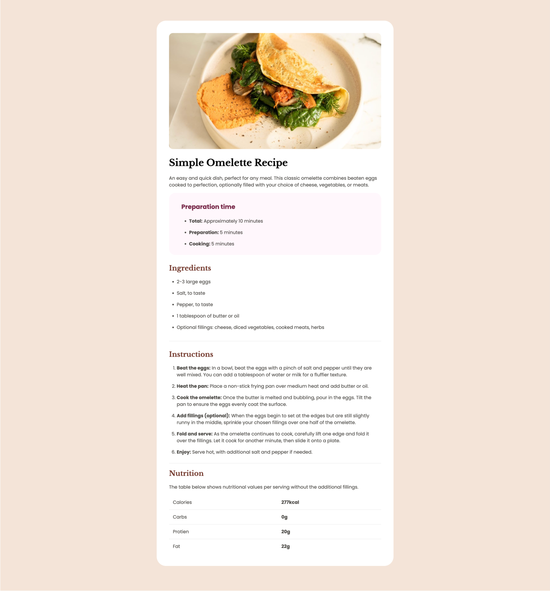

# Frontend Mentor - Recipe Page Solution

This is a solution to the [Recipe Page challenge on Frontend Mentor](https://www.frontendmentor.io/challenges/recipe-page-KiTsR8QQKm). Frontend Mentor challenges help you improve your coding skills by building realistic projects.

## Table of contents

- [Overview](#overview)
  - [Screenshot](#screenshot)
  - [Links](#links)
- [My process](#my-process)
  - [Built with](#built-with)
  - [What I learned](#what-i-learned)
  - [Continued development](#continued-development)
  - [Useful resources](#useful-resources)
- [Author](#author)

## Overview

The goal this project was to really make sure that I am progressing my CSS to become a betteer front end developer.

### Screenshot

### Links

- Solution URL:
- Live Site URL:

## My process

- **Understand the Challenge**:

  - Reviewed the project requirements and design brief.
  - Identified key features and functionality needed for the recipe page.

- **Planning and Design**:

  - Created wireframes to outline the layout and structure of the page.
  - Chose colors, fonts, and overall design elements based on the style guide.
  - Developed a responsive design strategy for different screen sizes (mobile and desktop).

- **Development**:

  - **HTML**: Set up the structure of the page using semantic HTML5 elements.
  - **CSS**: Applied styles using Flexbox and CSS Grid to achieve the desired layout.
    - Implemented the color scheme and typography as per the style guide.
    - Ensured responsiveness and accessibility across devices.
  - **JavaScript**: Added interactivity where needed, such as recipe filters or toggles.

- **Testing**:

  - Conducted cross-browser testing to ensure compatibility.
  - Tested responsiveness on various devices and screen sizes.
  - Validated accessibility to meet WCAG standards.

- **Optimization**:

  - Optimized performance by minimizing CSS and JavaScript files.
  - Implemented lazy loading for images to improve load times.

- **Deployment**:

  - Deployed the project to a live server.
  - Ensured that all links and interactive elements functioned correctly.

- **Review and Feedback**:

  - Reviewed the final product for any issues or improvements.
  - Sought feedback from peers or mentors and made necessary adjustments.

- **Documentation**:
  - Updated the README file with project details and instructions.
  - Provided clear and concise comments in the code for future reference.

### Built with

- Semantic HTML5 markup
- CSS custom properties
- Flexbox
- CSS Grid

### What I learned

Working on this project reinforced my skills in using Flexbox and CSS Grid for layout design. I learned how to manage spacing and alignment effectively and how to create a responsive layout using a mobile-first approach.

### Continued development

In future projects, I plan to:

1. **Explore Advanced CSS Grid Features**:

   - Deepen my understanding of CSS Grid to handle more complex layouts and nested grid structures.
   - Experiment with CSS Grid’s auto-fill and auto-fit properties for better responsive design.

2. **Enhance JavaScript Skills**:

   - Focus on learning advanced JavaScript concepts, such as asynchronous programming (async/await), and modern frameworks like [Vue.js](https://vuejs.org/).
   - Improve my skills in managing state and handling side effects in React applications.

3. **Improve Responsive Design Techniques**:

   - Refine my approach to responsive design to ensure that layouts work seamlessly across a wider range of devices and screen sizes.
   - Implement more comprehensive media queries and utilize CSS variables to manage design changes more effectively.

4. **Optimize Performance**:

   - Work on optimizing web performance, including reducing page load times and improving overall site speed.
   - Explore techniques such as lazy loading, code splitting, and efficient image handling.

5. **Expand Testing Practices**:
   - Implement unit testing and end-to-end testing for better code reliability and maintainability.
   - Use tools like [Jest](https://jestjs.io/) and [Cypress](https://www.cypress.io/) to ensure high-quality code.

By focusing on these areas, I aim to enhance the quality of my projects and stay updated with industry best practices.
